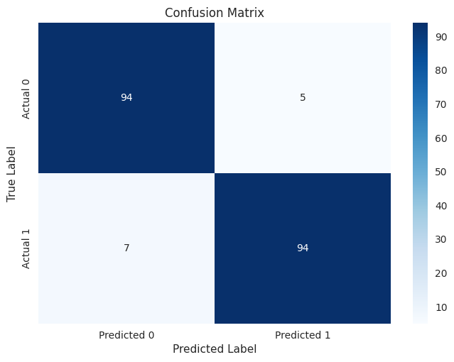
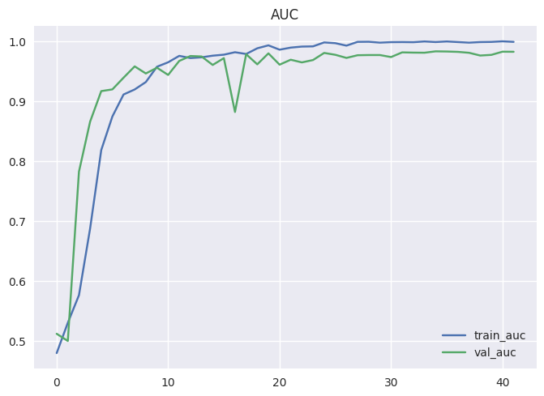
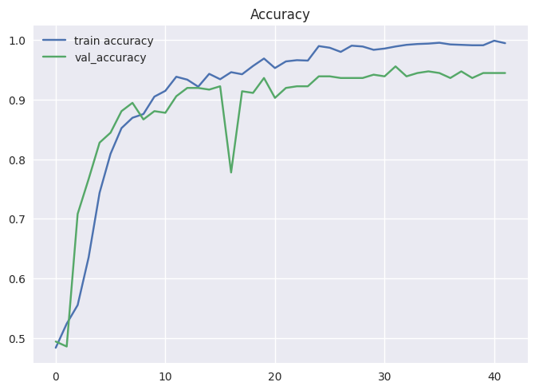

# Violence Action Recognition Project

## Overview

This project focuses on Violence Action Recognition using MobileNets and Bidirectional LSTMs. The goal is to develop a robust system capable of identifying violent actions in video data. The combination of MobileNets for efficient image processing and Bidirectional LSTMs for sequential data analysis aims to enhance the accuracy and performance of violence action recognition.

## Prerequisites

Before running the project, ensure you have the following dependencies installed:

- Python 3.x
- TensorFlow
- Keras
- OpenCV
- NumPy

You can install the required packages using the following command:

```bash
pip install tensorflow keras opencv-python numpy
```
## Dataset

The project requires a labeled dataset containing video clips with both violent and non-violent actions. Ensure that the dataset is split into training and testing sets for model evaluation.


## Model Architecture

The architecture consists of two main components:

1. **MobileNets for Feature Extraction:**
   MobileNets are used for efficient image processing and feature extraction. This lightweight architecture is suitable for real-time applications and helps reduce the computational load.

   

 

2. **Bidirectional LSTMs for Sequential Data Analysis:**
   Bidirectional LSTMs are employed to capture temporal dependencies and analyze the sequential nature of video data. This allows the model to understand the context of actions over time.


      

## Training

To train the model, follow these steps:

1. Run the training script using the following command:

    ```bash
    python script.py --dataset_path /path/to/dataset --epochs 50 --batch_size 32
    ```

   Adjust the parameters as needed, such as the number of epochs and batch size, based on your dataset and computational resources.

2. Monitor the training progress and review the training logs for insights into the model's performance.

3. Once training is complete, the trained model will be saved for evaluation and inference.

## Results

1. **Confusion Matrix:**
      

2. **AUC:**
      

3. **Accuracy:**
      


